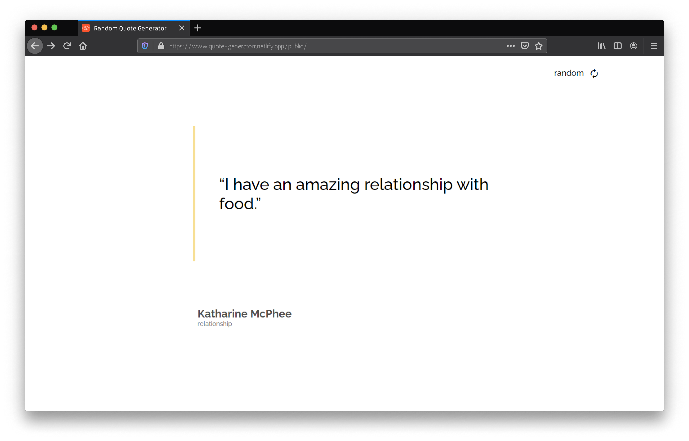

<h1 align="center">Random Quote Generator</h1>

<div align="center">
   Solution for a challenge from  <a href="http://devchallenges.io" target="_blank">Devchallenges.io</a>.
   <p align="center">
  
</p>
</div>

<div align="center">
  <h3>
    <a href="https://quote-generatorr.netlify.app/public/">
      Demo
    </a>
    <span> | </span>
    <a href="https://github.com/vitogd/quote-generator/tree/master/public">
      Solution
    </a>
    <span> | </span>
    <a href="https://devchallenges.io/challenges/8Y3J4ucAMQpSnYTwwWW8">
      Challenge
    </a>
  </h3>
</div>

___


## :information_source: Table of Contents

- [Overview](##overview)
  - [Built With](##built-with)
- [Features](##features)
- [How to use](##how-to-use)
- [Contact](##contact)
- [Acknowledgements](##Acknowledgements)

<!-- OVERVIEW -->

## Overview



<p align="center">
  <a href="https://quote-generatorr.netlify.app/public/" target="_blank">
    
  </a>
</p>

___

## :rocket: Technologies

- HTML
- CSS
- JavaScript

## Features

This application/site was created as a submission to a [DevChallenges](https://devchallenges.io/challenges) challenge. The [challenge](https://devchallenges.io/challenges/8Y3J4ucAMQpSnYTwwWW8) was to build an application to complete the given user stories.

## How To Use

<!-- For example: -->

To clone and run this application, you'll need [Git](https://git-scm.com) installed on your computer. From your command line:

```bash
# Clone this repository
$ git clone https://github.com/vitogd/quote-generator

# Goto index.html directory
$ cd quote-generator/public/

# Start with chrome
$ start chrome index.html
```

## Acknowledgements

- Learned how to replicate a design.
- Improve my fetch api skills.

## Contact

- GitHub [@vitogd](https://github.com/vitogd)
- Twitter [@vitogd1](https://twitter.com/vitogd1)

## :memo: License

This project is under the MIT license. See the [LICENSE](https://github.com/vitogd/quote-generator/blob/master/LICENSE) for more information.

___
